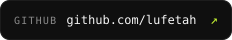
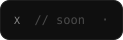

<!-- ⚠ GENERATED FILE — do not edit by hand. Change src/config.mjs and run `npm run build` (or just push; the Action rebuilds). -->

### Connect

  
  &nbsp;
  
  &nbsp;
  
  &nbsp;
  

↻ auto-updated daily from real GitHub activity · last refresh 2026-05-21

